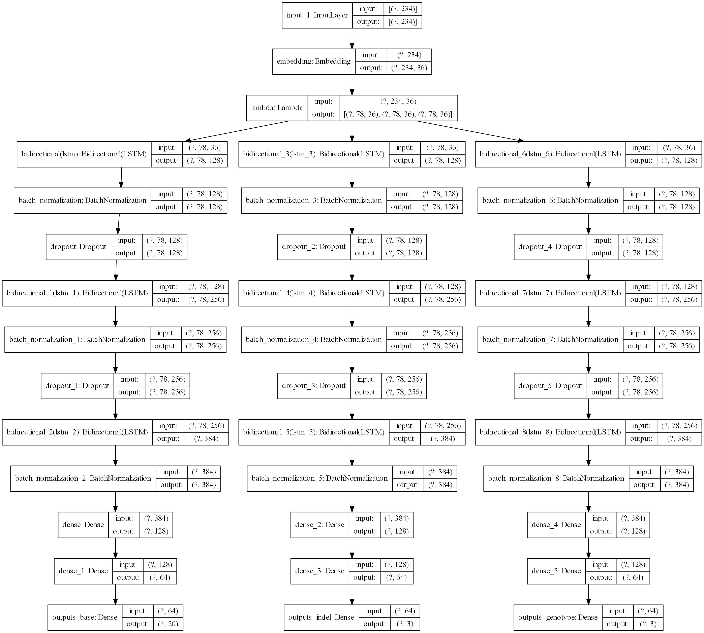

# scSNVIndel:Searching the potential of using Bi-LSTM neural network for single cell SNV and Indel calling.
<div align="center">
    
    <br>
</div>

## Introduction
Single cell sequence is popular sequencing technique in recent years.
With the emerging of single cell sequencing data, accurate calling the single cell SNV and inde 
is the focus of research. In this sudy, we propose a high precise model of calling single SNV and Indel.
The model is called scSNVIndel, which uses Bi-LSTM as base construction and integrate newly natural
language processing skill. Compared with existing tools including GATK, Monovar, DeepVarient, 
scSNVIndel achieves the best precision and speed. Through the result of scSNVIndel, we found that
scSNVIndel can call the complicated SNV and Indel, which is superior to others tools.

## Contents
 * Innovation
 * Model Architecture
 * Requirement
 * Installation
 * Usage
 * Demo
 * Display

## Innovation
As we know, single cell data is different form Next Generation Data.
The single cell data is sparse and the coverage is low, so it is
challenge to call the SNV and  Indel from whole genome. On the one hand,
Using the machine learning method to extract features is difficult to cover the various special situation of variants.
we hope to use deep neural network to automatically find useful features, and train the model to call the variants precisely.
On the other hand, because the sequencing is string in nature, the natural language processing can perfect identify the sequence feature.
There are a few of calling methods based on deep learning, like DeepSV, DeepVariant. Most of these tools
use convolutional neural network to detect the SNV and Indel, but it is not suitable single cell data that are low coverage in the whole gnome.
We put forward a new detection method based on recurrent neural network, which can process string data as well as get rid of the sparse data constraint. 

## Model Architecture
The scSNVIndel has one input and three outputs. First, the scSNVIndel generates each position alignment bases from BAM,
and reference gene from FASTA. Second, the scSNVIndel collect the Indel array using pysam package.
Finally, the scSNVIndel generates the genotype array through alignment situation.
The scSNVIndel concatenates the results obtained from the above three parts as the model input.
The scSNVIndel send this results in to the network to train. The model architecture is in the Figure 1.
<div align="center">
    
    <br>
  <div align="center">Fig-1</div>
</div>
The output is respectively base situation, indel situation, and genotype situation.
The base situation is whether the base occurs changed. If changed, the model will report the changing situation.
The indel situation reports whether the Indel has occured on one position.
The genotype reports the mutation is homozygous or heterozygous when finding variants.


##  Requirement
We use docker and Anaconda to build the environment, and we use Tensorflow to construct the scSNVIndel.
* conda 4.8.3
* Docker 19.03.8
* graphviz                  2.40.1
* numpy                     1.18.1
* pip                       20.0.2
* python                    3.6.10
* pydot                     1.4.1
* pysam                     0.15.4  
* scipy                     1.4.1
* tensorflow                2.2.0
* tensorboard               2.2.1

## Installation
### Method 1: Build an anaconda virtual environment
```
# Docker pull the Image
docker pull nvidia/cuda:10.1-cudnn7-devel-ubuntu18.04
docker run --name container-name --gpus all -v dir:dir -itd nvidia/cuda:10.1-cudnn7-devel-ubuntu18.04 /bin/bash 
docker exec -it container-name /bin/bash

# Installation anaconda
curl https://repo.anaconda.com/archive/Anaconda3-2020.02-Linux-x86_64.sh -o miniconda3.sh
bash miniconda3.sh -b -p /opt/miniconda3
conda update -n base -c defaults conda pip

# create and activate the environment named scSNVIndel
conda create -n scSNVIndel python=3.6
source activate scSNVIndel

# install python packages on scSNVIndel environment
pip install conda-forge numpy==1.18.1 blosc==1.8.3 tensorflow-gpu==2.2.0 pysam==0.15.4 matplotlib==3.1.2
conda install -c anaconda pigz==2.4
conda install -c bioconda samtools=1.10 vcflib=1.0.0 bcftools=1.10.2

# clone scSNVIndel
git clone git@github.com:CSuperlei/scSNVIndel.git
```

### Method 2: Dockerfile
```
FROM nvidia/cuda:10.1-cudnn7-devel-ubuntu18.04
MAINTAINER CSuperlei<csuperlei@163.com>

RUN apt upgrade -y && apt update -y && \
    mkdir -p /root/.cpan && \
    apt autoremove -y && apt clean -y && apt purge -y && rm -rf /tmp/* /var/tmp/* 

RUN apt install -y wget curl net-tools iputils-ping locales  \
    zip unzip bzip2 apt-utils zlib1g zlib1g-dev \
    tmux screen \
    gcc g++ \
    vim git htop xclip cmake sudo tree jq \
    build-essential gfortran automake bash-completion \
    libapparmor1 libedit2 libc6 \
    psmisc rrdtool libzmq3-dev libtool apt-transport-https \
    && locale-gen en_US.UTF-8 && \
    apt autoremove -y && apt clean -y && apt purge -y && rm -rf /tmp/* /var/tmp/* 

# bash && ctags && cscope && gtags
RUN apt install cscope libncurses5-dev -y && \
    cd /tmp && \
    curl https://ftp.gnu.org/gnu/bash/bash-5.0.tar.gz -o bash-5.0.tar.gz && \
    tar xzf bash-5.0.tar.gz && cd bash-5.0 && ./configure && make && make install && \
    cd /tmp && \

# conda
ADD .condarc /root
ENV PATH=/opt/miniconda3/bin:$PATH
RUN cd /tmp && \
    rm -f /bin/bash && ln -s /usr/local/bin/bash /bin/bash && \
    curl https://repo.anaconda.com/archive/Anaconda3-2020.02-Linux-x86_64.sh -o miniconda3.sh && \
    bash miniconda3.sh -b -p /opt/miniconda3 && \
    conda update -n base -c defaults conda pip && \
    conda clean -a -y && \
    apt autoremove -y && apt clean -y && apt purge -y && rm -rf /tmp/* /var/tmp/* 

# conda install
RUN conda install -n base -c conda-forge time libxml2 libxslt libssh2 krb5 ripgrep lazygit yarn nodejs=12.16 jupyterlab=2.0.1 && \
    /opt/miniconda3/bin/pip install --no-cache-dir -i http://pypi.douban.com/simple --trusted-host pypi.douban.com pynvim neovim-remote flake8 pygments ranger-fm msgpack-python jedi==0.15.2 && \
    /opt/miniconda3/bin/pip install --no-cache-dir -i http://pypi.douban.com/simple --trusted-host pypi.douban.com python-language-server && \
    conda clean -a -y && \
    apt autoremove -y && apt clean -y && apt purge -y && rm -rf /tmp/* /var/tmp/* 

# common package
RUN /opt/miniconda3/bin/pip install --no-cache-dir -i http://pypi.douban.com/simple --trusted-host pypi.douban.com pandas scikit-learn numpy matplotlib scipy seaborn ggplot plotly xgboost && \
    conda clean -a -y && \
    apt autoremove -y && apt clean -y && apt purge -y && rm -rf /tmp/* /var/tmp/* 

# conda env deeplearning construction and installation of deeplearning framework
RUN conda create -n lei_env python=3.6 && \
    source activate lei_env && \
    conda install pytorch torchvision -c pytorch && \
    conda install tensorflow-gpu=2.2.0 keras && \
    conda install pysam
    conda clean -a -y && \
    conda deactivate && \
    apt autoremove -y && apt clean -y && apt purge -y && rm -rf /tmp/* /var/tmp/*

RUN mkdir scSNVIndel && \
    cd scSNVIndel && \
    git clone git@github.com:CSuperlei/scSNVIndel.git
```

# Usage
```
scSNVIndel software

optional arguments:
  -h, --help            show this help message and exit
  --vcf, -v             vcf filename
  --bam, -b             bam filename
  --fasta, -fa          fasta filename
  --fastq, -fq          fastq filename
  --gpus, -g            gpu number
  --log,-lo             log level
  --data, -d            data filename
  --data_model, -dm     data generator mode; mode 1 gernerates variant data, mode 2 generates normal data
  --load, -ld           load filename
  --region, -r          test data list
  --test, -tm           test;  mode 1 is batch test, mode 2 is random data
  --dc_origin, -dco     data combine original directory
  --dc_target, -dct     data combine target filename
  --mode, -m            mode 1 is training; mode 2 is tesing; mode 3 generates data; mode 4 combines data

```

# Demo
* Generation training data
```
## generation variant data
python main.py -v ${vcf file name} -b ${bam file name} -fa ${fasta file name} -d ${output of variant data} -lo ${log level} -m 3 -dm 1

## generation non-variant data
python main.py -v ${vcf file name} -b ${bam file name} -fa ${fasta file name} -d ${output of non-variant data} -lo ${log level} -m 3 -dm 2

```

* Combine data of variation and non-variation   
```
python main.py -dco ${data combine original directory} -dct ${output of data combine target filename} -m 4

```

* Training scSNVIndel
```
python main.py -ld ${load training filename} -g ${gpu numbers} -lo {log level} -m 1
```

* Generation testing data
```
python main.py -b ${bam file} -fa {fasta file} -r {test region file} -d {out put test data} -lo {log level} -m 3

```

* Validation the model
```
python main.py  -ld {test data file} -g {gpu numbers} -lo {log level} -m 2 -tm 2

```

# Display
We will show the training and validation curve in the following.
The scSNVIndel has three outputs. The first output represents whether a base shift has occurred.
The first output training and validation curve is the Figure 2.
<div align="center">
    
    <br>
  <div align="center">Fig-2</div>
</div>
The second output represents whether a Indel has occurred.
The sencond training and validation curve is the Figure 3.
<div align="center">
    
    <br>
  <div align="center">Fig-3</div>
</div>
The third output represents the genotype of variation
The third output training and validation curve is the Figure 4.
<div align="center">
    
    <br>
  <div align="center">Fig-4</div>
</div>


